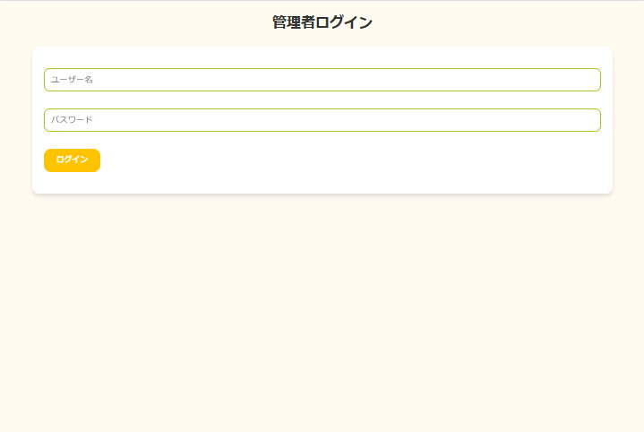
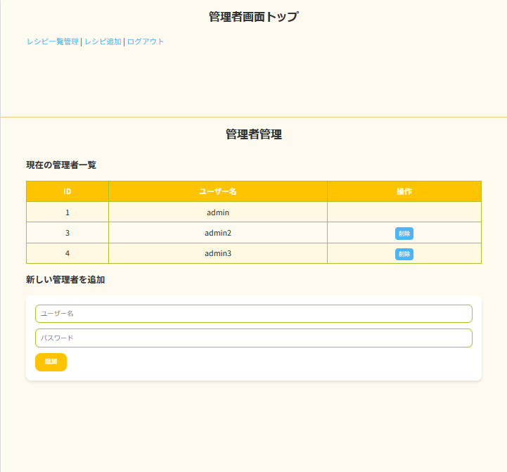
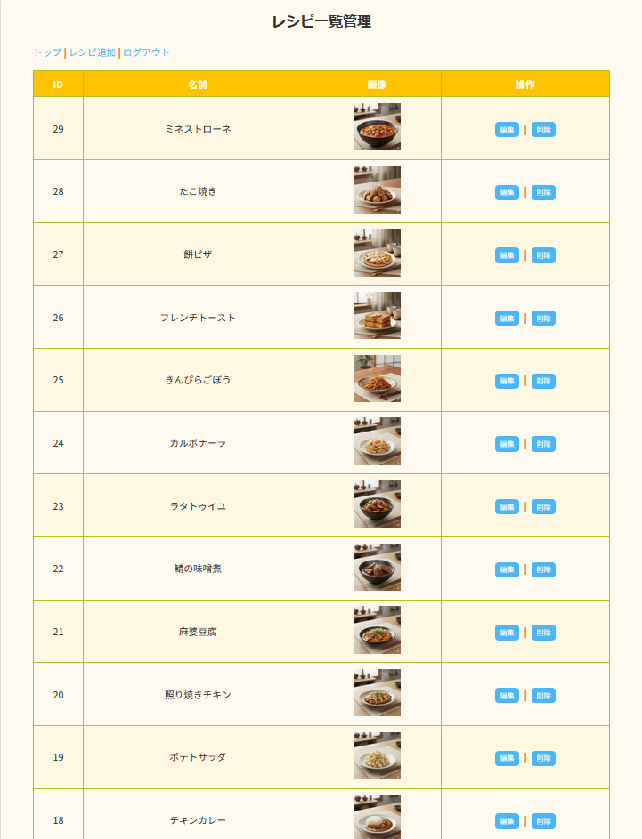
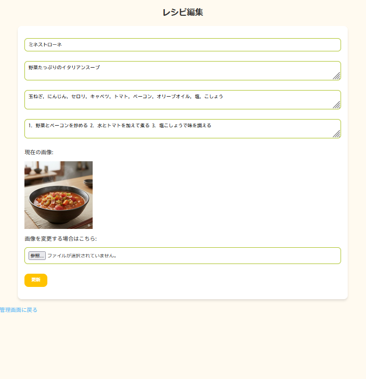
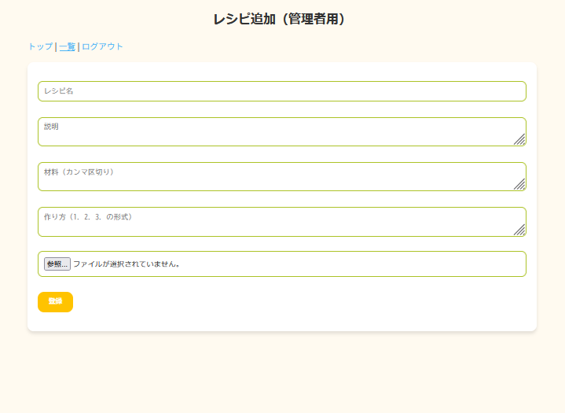

# レシピ検索サイト ポートフォリオ

## サイト概要
- PHP & MySQL で作成したレシピ検索サイト
- ユーザーはレシピの閲覧・検索・絞り込みが可能
- 管理者はレシピの追加・編集・削除、管理者の追加・削除が可能

---

## デモサイト
- ユーザー用ページ: [https://sophia-hp.jp/dz009/recipe/](https://sophia-hp.jp/dz009/recipe/)
- 管理者用ページ（デモアカウント）: アクセスは制限されています
  - デモアカウントを希望される場合は別途お問い合わせください

※セキュリティ上、管理者アカウントのパスワードは公開していません。

---

## デモ用スクリーンショット

### 管理画面ログイン

### 管理画面トップ

### レシピ管理画面

### レシピ編集画面

### レシピ追加画面

---

## 機能一覧

### ユーザー向け
- レシピ検索（キーワード・材料）
- レシピ一覧・詳細表示
- ページネーション対応

### 管理者向け
- データベースの操作画面（ログイン必須）
  - レシピの追加・編集・削除
  - 管理者の追加・削除

---

## 技術スタック
- PHP
- MySQL
- HTML / CSS / JavaScript
- GitHub でバージョン管理

---

## 注意
- 本ポートフォリオは就活用のデモサイトです。
